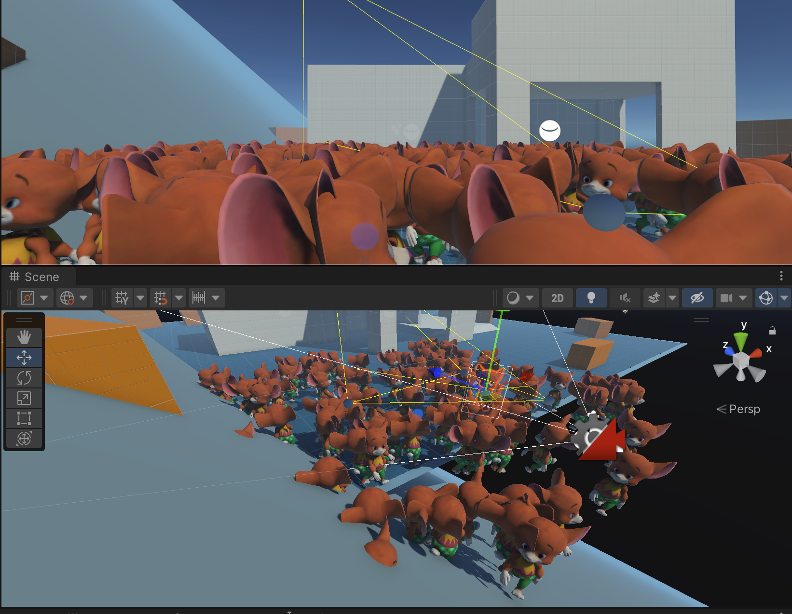
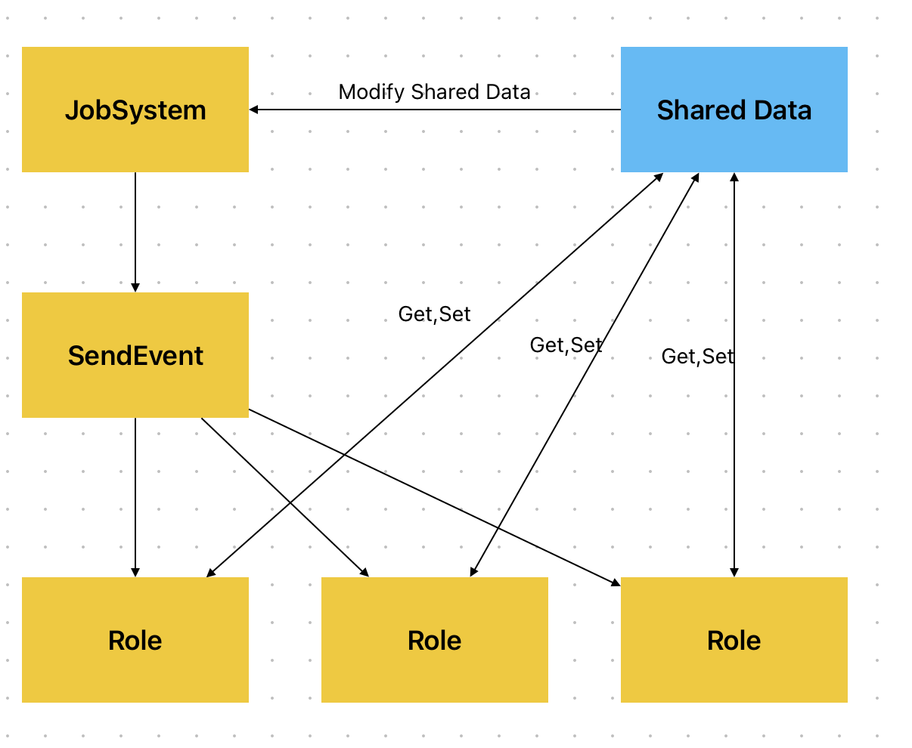

# Unity3DJobDemo
## Overview
This demo shows how to use the Job system to parallel execute roles actions. control roles by the job system can significantly improve performance, especially for role movements and role logic executions. 


This project designed a **shared data** for roles and job system, once the job system parallel executed all shared data, then the job manager will send an event for all roles, and all roles use the **shared data** to execute their own animation.



## Job System Code
### RoleManager
* used to create a job system and execute the job system, and also store public shared data for all roles.

```CSharp

using System;
using System.Collections;
using System.Collections.Generic;
using Unity.Collections;
using Unity.Jobs;
using UnityEngine;
using UnityEngine.Jobs;
using Random = UnityEngine.Random;
public class RoleManager : Singleton<RoleManager>
{
    // Start is called before the first frame update
    [SerializeField] GameObject rolePrefab;

    [Header("Job System")]
    public static Action Event_RoleManagerJobDone;
    List<RoleController> _roleList = new List<RoleController>();
    public NativeArray<int> state;// 0000001, Idle, 0000010, Move, 0000100, Attack, 0001000, Dead
    public NativeArray<Vector3> targetPosition;//roles' target position, users will keep moving to this position
    TransformAccessArray _roleTransformAccessArray;//roles' transform
    RoleJob _roleJob;
    JobHandle _jobHandle;
    [SerializeField] int _maxSizeOfRoles = 20;
    void Start()
    {
        //initial all Native Arrays for job system
        _roleTransformAccessArray = new TransformAccessArray(_maxSizeOfRoles);
        state = new NativeArray<int>(_maxSizeOfRoles, Allocator.Persistent);
        targetPosition = new NativeArray<Vector3>(_maxSizeOfRoles, Allocator.Persistent);

        //loop to create roles
        for (int i = 0; i < _maxSizeOfRoles; i++)
        {

            //set them in first level of hierarchy for better performance
            GameObject role = Instantiate(rolePrefab);
            //set random position
            role.transform.position = new Vector3(Random.Range(-10, 10), 0, Random.Range(-10, 10));
            _roleTransformAccessArray.Add(role.transform);
            //set target position
            targetPosition[i] = role.transform.position;
            //set the index of each role
            RoleController roleController = role.GetComponent<RoleController>();
            roleController.RoleIndex = i;
            _roleList.Add(roleController);
            //initial state
            state[i] = 1;//0000001, Idle
        }
    }

    void Update()
    {
        //start job loop
        _roleJob = new RoleJob
        {
            _targetPosition = targetPosition,
            _state = state,
            _deltaTime = Time.deltaTime
        };
        _jobHandle = _roleJob.Schedule(_roleTransformAccessArray);
        _jobHandle.Complete();
        //job done, send event
        Event_RoleManagerJobDone?.Invoke();
    }
    private void OnDisable()
    {
        state.Dispose();
        _roleTransformAccessArray.Dispose();
        targetPosition.Dispose();
    }
}

```

### RoleJob
* This is the role's core logic including transform modification and logic modification

```CSharp

using System.Collections;
using System.Collections.Generic;
using Unity.Burst;
using Unity.Collections;
using UnityEngine;
using UnityEngine.Jobs;

[BurstCompile]
public struct RoleJob : IJobParallelForTransform
{
    [ReadOnly] public NativeArray<Vector3> _targetPosition;
    public NativeArray<int> _state;
    [ReadOnly] public float _deltaTime;
    bool _isIdle;
    bool _isWalking;
    public void Execute(int index, TransformAccess transform)
    {
        TranslateState(index);
        RoleAI(index, transform);
        UpdateState(index);
    }
    void TranslateState(int index)
    {
        _isIdle = (_state[index] & (1 << 0)) == (1 << 0) ? true : false;
        _isWalking = (_state[index] & (1 << 1)) == (1 << 1) ? true : false;
    }
    void RoleAI(int index, TransformAccess transform)
    {
        if (_isIdle)
        {
            _isWalking = true;
            _isIdle = false;
        }
        else if(_isWalking)
        {
            if(transform.position != _targetPosition[index])
            {
                transform.rotation = Quaternion.Slerp(transform.rotation, Quaternion.LookRotation(_targetPosition[index] - transform.position), 5.0f * _deltaTime);
                transform.position = Vector3.MoveTowards(transform.position, _targetPosition[index], 2.0f * _deltaTime);
            }
            else
            {
                _isWalking = false;
                _isIdle = true;
            }
        }
    }
    void UpdateState(int index)
    {
        _state[index] = 0;
        _state[index] |= _isIdle ? 1 << 0 : 0;
        _state[index] |= _isWalking ? 1 << 1 : 0;
    }
}
```